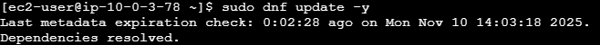

# 2025-11-10 자료조사 : EC2로 이미지 무결성 검사하기

> ***목표 : EC2로 VPC 생성했던걸로 보안 그룹 걸고, 
ECR에서 이미지 받아와서 실행하면 컨테이너가 돌아가나요?***
> 

1. 해당 실습을 진행하기 위해서는 당연히 EC2 인스턴스가 필요하니, EC2 인스턴스를 가져와줍시다.
- 이름 : Bwapp-test-sct
- OS: Amazon Linux 2023 kernel - 6.1 AMI
- 인스턴스 유형 : t3.micro (2vCPU, 1GiB)
- 키페어 : RSA 타입 SSH 연결가능한 키페어 생성, Tag : Bwapp-Ec2-test-sct
- 네트워크 설정
    - VPC: SCT-vpc
    - 서브넷 : SCT-subnet-private1-ap-northeast-2a
    - 퍼블릭 IP 자동활성화 : ON
    - 보안그룹 : 기존 보안 그룹 선택
        - ~~Bwapp-Ecs-sg~~  → vpc-default 선택
- 스토리지 구성 : 8GiB 루트 볼륨

1. EC2 엔드포인트 만들어주기 : 접속을 위해서 사용해봅시다.
해당 EC2 인스턴스가 실행 가능해도, 바로 연결하는 것은 불가능하다. 
왜일까? EC2 인스턴스는 현재 위에 설정에서도 프라이빗 서브넷에 있기에 접속할 수 없음. 
그렇기에 접근할 수 있는 EC2용 비밀통로를 하나 만들어줘야겠죠? 그것이 엔드포인트.
- VPC → 엔드포인트로 접근 → 엔드포인트 생성
- 엔드포인트 설정
- 이름: - (미설정)
- 유형 : EC2 인스턴스 연결 엔드포인트
- 네트워크 설정
    - VPC : SCT-VPC
    - 보안그룹: ~~Bwapp-ecs-sg~~  → vpc-default
    - 서브넷 : SCT-subnet-private1-ap-northeast-2a
    - IP주소 유형: IPv4 (해당 VPC는 에초에 IPv6용 CIDR 블럭이 없음, 즉 IPv6나 듀얼스택 사용 X)

1. 잠시대기하면, 엔드포인트 및 EC2 초기 설정이 완료된다.

1. EC2 인스턴스에서 위에 인스턴스 클릭하고 [연결] 클릭

1. 연결 유형은 [프라이빗 IP를 사용하여 연결]
현재 우리 EC2 퍼블릭 서브넷에 있는 것이 아니기에, 인스턴스가 퍼블릭에 없다고 경고가 뜸.
- 생성한 엔드포인트 선택
- 사용자 이름 : ec2 -user
- [연결]버튼 클릭

하면 바로 연결이 실패한다. 이유가 뭘까?

생각보다 단순하다.

보안그룹을 : Bwapp-ecs-sg로 했다. 이때 우리의 보안 그룹 설정을 봐볼까?

- 인바운드 규칙: ABL로 들어오는 7890 포트의 TCP 연결을 받도록 되어있다.
- 아웃바운드 규칙: IPv4로 0.0.0.0/0(모든 IP), 모든 포트로 연결이 나가게 되어있다.

그렇다면.. EC2에 연결하기 위해서 엔드포인트를 사용할때, 우리가 SSH를 사용한다 했다.

(대부분 모든 SSH 연결에서 사용하는 포트는 TCP 22번 포트이다. AWS도 기본값은 같다.)

현재 그렇다면, 문제는 바로 보안그룹 설정 오류라는 것이다.

그래서 보안그룹 설정을 바로 변경해줬다. 기본값으로.

바로 잘 접속된다.

다 했다면, 이제 도커를 깔고 이미지를 설치할 수 있어야한다. 그렇다면 필요한 것은 2가지이다.

1. AWS cli 환경 → ECR 접근
2. Docker Desktop → 이미지 설치 후 실행 환경

1번의 문제를 해결하기 위해서는 ECR에 이미지 접근을 할 수 있도록 엔드 포인트를 하나 더 파야한다.

- 엔드포인트 설정
- 이름: - (미설정)
- 유형 : AWS 서비스
- 서비스 : com.amazonaws.ap-northeast-2.ecr.dkr
 (관리에는 api 서비스, 이미지용은 dkr 서비스를 사용한다고 한다.)
- 네트워크 설정
    - VPC : SCT-VPC
    - 보안그룹: ~~Bwapp-ecs-sg~~  → VPC-default
    - 서브넷 : SCT-subnet-private1-ap-northeast-2a
    - IP주소 유형: IPv4 (해당 VPC는 에초에 IPv6용 CIDR 블럭이 없음, 즉 IPv6나 듀얼스택 사용 X)
1. AWS Cli 환경 설정하기
- 전체 명령어 + 진행과정 + 설명(AI 사용)
    
    # ☁️ Amazon Linux 2023 — AWS CLI v2 설치
    
    ---
    
    ## 📚 전체 명령 요약 (Amazon Linux 2023)
    
    ```bash
    sudo dnf install -y unzip
    curl "https://awscli.amazonaws.com/awscli-exe-linux-x86_64.zip" -o "awscliv2.zip"
    unzip awscliv2.zip
    sudo ./aws/install
    aws --version
    aws configure
    aws sts get-caller-identity
    ```
    
    ---
    
    ## 🧩 ① 설치 파일 다운로드
    
    ```bash
    curl "https://awscli.amazonaws.com/awscli-exe-linux-x86_64.zip" -o "awscliv2.zip"
    ```
    
    | 구성 | 설명 |
    | --- | --- |
    | `curl` | 인터넷에서 파일을 다운로드하는 명령어 |
    | `"https://awscli.amazonaws.com/awscli-exe-linux-x86_64.zip"` | AWS CLI v2 공식 배포 경로 (64비트 Linux용) |
    | `-o "awscliv2.zip"` | 다운로드 후 저장할 파일 이름을 지정 (`awscliv2.zip`) |
    
    💡 **역할:**
    
    AWS CLI 설치 패키지를 공식 사이트에서 EC2로 직접 내려받습니다.
    
    ---
    
    ## 🧩 ② 압축 해제
    
    ```bash
    unzip awscliv2.zip
    ```
    
    | 구성 | 설명 |
    | --- | --- |
    | `unzip` | ZIP 파일을 푸는 명령어 |
    | `awscliv2.zip` | 위에서 다운로드한 설치 파일 |
    
    💡 실행 후 디렉터리 구조:
    
    ```
    aws/
     ├── install
     ├── dist/
     ├── awscli/
    ```
    
    > 🔹 Amazon Linux 2023은 기본적으로 unzip이 포함되어 있지만,
    > 
    > 
    > “command not found”가 뜨면 `sudo dnf install unzip -y`로 설치하세요.
    > 
    
    ---
    
    ## 🧩 ③ AWS CLI 설치
    
    ```bash
    sudo ./aws/install
    ```
    
    | 구성 | 설명 |
    | --- | --- |
    | `sudo` | 관리자 권한으로 실행 (시스템 전체에 설치하려면 필요) |
    | `./aws/install` | 방금 압축을 푼 설치 스크립트 경로 |
    
    💡 **내부 동작**
    
    - `/usr/local/aws-cli/` 경로에 AWS CLI 프로그램을 설치합니다.
    - `/usr/local/bin/aws` 심볼릭 링크를 만들어 CLI를 전역에서 쓸 수 있게 함.
    - 설치 완료 시 메시지:
        
        ```
        You can now run: /usr/local/bin/aws --version
        ```
        
    
    ---
    
    ## 🧩 ④ 설치 확인
    
    ```bash
    aws --version
    ```
    
    | 구성 | 설명 |
    | --- | --- |
    | `aws` | AWS CLI 명령 실행기 |
    | `--version` | 버전 정보 표시 |
    
    💡 정상 출력 예시:
    
    ```
    aws-cli/2.17.38 Python/3.11.8 Linux/6.1.72-108.177.amzn2023.x86_64 exe/x86_64.amzn.2023
    ```
    
    > 이렇게 나오면 CLI가 정상 설치 및 PATH 등록 완료입니다 ✅
    > 
    
    ---
    
    ## 🧩 ⑤ AWS 자격증명 설정
    
    ```bash
    aws configure
    ```
    
    | 질문 | 설명 |
    | --- | --- |
    | `AWS Access Key ID [None]:` | IAM 사용자의 Access Key |
    | `AWS Secret Access Key [None]:` | IAM 사용자의 Secret Key |
    | `Default region name [None]:` | 기본 리전 (예: `ap-northeast-2` → 서울) |
    | `Default output format [None]:` | 출력 형식 (`json`, `text`, `table` 중 선택, 보통 `json`) |
    
    💡 **설정 파일 위치**
    
    - 자격증명: `~/.aws/credentials`
        
        ```
        [default]
        aws_access_key_id = AKIAxxxxxxx
        aws_secret_access_key = XXXXXXXXXXXXXXXX
        ```
        
    - 환경 설정: `~/.aws/config`
        
        ```
        [default]
        region = ap-northeast-2
        output = json
        ```
        
    
    ---
    
    ## 🧩 ⑥ IAM 권한 테스트 (정상 확인)
    
    ```bash
    aws sts get-caller-identity
    ```
    
    💡 **역할:**
    
    현재 로그인된 IAM 사용자 또는 역할 정보를 출력합니다.
    
    출력 예시:
    
    ```json
    {
        "UserId": "AIDAEXAMPLE123456",
        "Account": "123456789012",
        "Arn": "arn:aws:iam::123456789012:user/ec2-user"
    }
    ```
    
    ✅ 이렇게 나오면 **AWS CLI 인증이 정상적으로 작동**하는 것입니다.
    
    ---
    
    ## 🧩 ⑦ ECR 로그인 테스트
    
    AWS CLI와 Docker 연동 시 가장 자주 쓰는 명령입니다 👇
    
    ```bash
    aws ecr get-login-password --region ap-northeast-2 | \
    docker login --username AWS --password-stdin <account-id>.dkr.ecr.ap-northeast-2.amazonaws.com
    ```
    
    | 부분 | 설명 |
    | --- | --- |
    | `aws ecr get-login-password` | ECR 인증 토큰(12시간 유효)을 가져옵니다. |
    | `--region ap-northeast-2` | 리전 지정 (서울) |
    | ` | docker login ...` |
    | `<account-id>.dkr.ecr.ap-northeast-2.amazonaws.com` | ECR의 Docker endpoint (이미지 push/pull용) |
    
    💡 이 과정을 통해 Docker가 ECR에서 이미지를 pull/push할 수 있게 됩니다.
    

1. 도커 설치하기
- 전체 명령어 + 진행과정 + 설명 (AI 사용)
    
    ```bash
    sudo dnf update -y
    sudo dnf install -y docker
    sudo systemctl enable docker
    sudo systemctl start docker
    sudo usermod -aG docker ec2-user
    ```
    
    ## ① 시스템 업데이트
    
    ```bash
    sudo dnf update -y
    ```
    
    | 항목 | 설명 |
    | --- | --- |
    | `sudo` | root 권한으로 실행 |
    | `dnf` | Amazon Linux 2023의 패키지 관리자 |
    | `update` | 시스템 내 모든 패키지를 최신 버전으로 업데이트 |
    | `-y` | 설치 중 질문에 자동으로 “Yes” 응답 |
    
    💡 **이유:**
    
    Docker 설치 전에 시스템 패키지를 최신화해야 **의존성 충돌**을 방지
    
    특히 커널/네트워크 관련 패키지가 오래되면 `docker.service`가 안 켜질 수도 있음
    
    - 진행 사진
    
    
    
    ---
    
    ## ② Docker Engine 설치
    
    ```bash
    sudo dnf install -y docker
    ```
    
    | 항목 | 설명 |
    | --- | --- |
    | `install` | 새 패키지 설치 명령 |
    | `docker` | Amazon Linux 2023 기본 리포지토리에 포함된 Docker Engine 패키지 |
    | `-y` | 모든 설치 확인 자동 진행 |
    
    💡 **내부 동작:**
    
    - `docker`, `containerd`, `runc` 등 필요한 하위 패키지를 자동으로 같이 설치
    - Amazon Linux 2023은 기본적으로 Docker를 지원하므로 **별도 리포 추가 필요 없음**
    - 설치 경로 예시:
        
        ```
        /usr/bin/docker
        /usr/bin/containerd
        /usr/lib/systemd/system/docker.service
        ```
        
    
    - 설치 사진

    
    ---
    
    ## ③ 부팅 시 자동 실행 설정
    
    ```bash
    sudo systemctl enable docker
    ```
    
    | 항목 | 설명 |
    | --- | --- |
    | `systemctl` | Linux의 서비스(데몬) 관리 도구 |
    | `enable` | 부팅 시 자동으로 Docker 서비스를 실행하도록 설정 |
    
    💡 즉, EC2 인스턴스가 재부팅되더라도 `docker.service`가 자동으로 시작
    
    - 설치 사진
    
    
    ---
    
    ## ④ Docker 서비스 시작
    
    ```bash
    sudo systemctl start docker
    ```
    
    | 항목 | 설명 |
    | --- | --- |
    | `start` | 지금 당장 Docker 데몬을 실행 |
    | 결과 확인 | `sudo systemctl status docker` 또는 `ps aux |
    
    💡 **성공 시 출력 예시:**
    
    ```
    Active: active (running) since Mon 2025-11-10 12:31:02 UTC; 5s ago
    ```
    
    - 설치 사진
    
    
    ---
    
    ## ⑤ 현재 사용자(docker 그룹 추가)
    
    ```bash
    sudo usermod -aG docker ec2-user
    ```
    
    | 항목 | 설명 |
    | --- | --- |
    | `usermod` | 사용자 계정 속성 변경 명령 |
    | `-aG` | 그룹을 추가(`append Group`) |
    | `docker` | Docker 데몬에 접근할 수 있는 시스템 그룹 |
    | `ec2-user` | 기본 로그인 사용자 이름 |
    
    **이유:**
    
    Docker 데몬은 root 권한이 필요하지만, 이 설정을 하면
    
    `sudo docker ps` 대신 그냥 `docker ps` 명령을 쓸 수 있습니다.
    
    > 주의: 변경 사항은 로그아웃 후 다시 로그인해야 적용됩니다.
    > 
    - 설정 사진
    
    
    ---
    
    ## ➅ 설치 완료
    
    

1. 도커에서 이미지 받고 설치하기

1. ECR로그인을 도커에다가 등록


1. 이미지 확인하기

```bash
aws ecr describe-repositories --region ap-northeast-2
```


- 레포지토리 종류 확인

- 이미지 제발 TAG 달아서 빌드해주세요(저거 sha256치는거 겁나 어려워요)


- 이미지 종류 확인


- 이미지 풀  (이미 미리 다운로드를 받았었음)

```python
docker image inspect 329984431650.dkr.ecr.ap-northeast-2.amazonaws.com/ljh_1:latest \ --format '{{.Config.ExposedPorts}} {{.Config.Env
}}'
```

위에 코드로 어떤 포트를 노출하고, 환경에 대한 설정값을 확인하기로 함.

(이후에는 콘솔에는 사진을 찍어놨지만, 날아간 관계로 기술 내용을 서술하는 것으로 진행합니다.)

- 확인 결과로는 Dockerfile이 80번 포트를 노출하는 것을 확인.

- 이후 curl 명령어로 접근했으나… 접근에 실패하고 돌아오는 응답이 없어서, Docker exec 명령어로 쉘에 들어갔으나, 존재하는 파일이 없었음.

### 결과: 실패.

- 사유 :
1. 도커에 이미지에 아무런 파일이 없는 상태거나, 잘못된 상태로 빌드되었을 가능성
2. 이미지를 불러오는 과정이나, 설치하는 과정에서 잘못 설치되었을 가능성

- 이후 시도해볼 행동 :
    
    이미지 빌드을 다시 처음부터 진행한 후 재배포.
