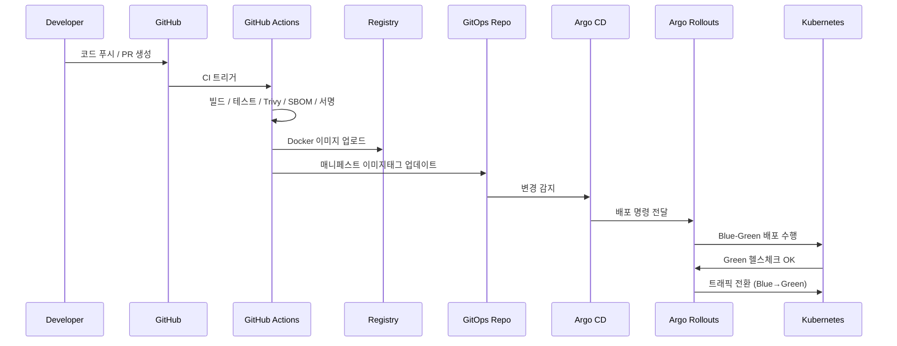

# 🧩 DevOps 아키텍처 그리기

---

## 📘 개요
- **목적:** DevOps 파이프라인 전체 흐름을 시각적으로 구조화  
- **핵심 요소:**  
  - CI: GitHub Actions (Self-hosted Runner)  
  - CD: Argo CD + Argo Rollouts (Blue-Green)  
  - 런타임: Kubernetes  
  - 보안: Vault + External Secrets Operator  
  - 관측: Prometheus + Grafana + Loki  

---

## 🧱 주요 구성요소
| 구분 | 구성 요소 | 역할 |
|------|------------|------|
| 개발 / 코드 관리 | **GitHub** | 코드 저장 및 PR 관리 |
| CI 빌드/테스트 | **GitHub Actions (Self-hosted Runner)** | 빌드, 테스트, 취약점 검사, SBOM 생성 |
| 이미지 저장 | **Container Registry (GHCR/Harbor)** | 빌드된 Docker 이미지 저장 |
| 배포 선언 | **GitOps Repository** | 배포 설정(Helm/Kustomize) 저장 |
| CD 자동배포 | **Argo CD + Argo Rollouts** | GitOps 기반 Blue-Green 배포 |
| 런타임 환경 | **Kubernetes Cluster** | 서비스 실행 및 확장 |
| 시크릿 관리 | **Vault + External Secrets Operator** | 민감정보 안전 관리 및 동기화 |
| 관측 / 로그 | **Prometheus + Grafana + Loki** | 메트릭 수집, 대시보드 시각화, 로그 관리 |

---

## 🔁 데이터 / 프로세스 흐름 (Mermaid 다이어그램)

'''
flowchart LR
  subgraph Dev[개발 & 코드 저장소]
    A[GitHub Repository]
  end

  subgraph CI[CI 단계]
    B[GitHub Actions (Self-hosted Runner)]
  end

  subgraph REG[이미지 레지스트리]
    C[(Container Registry)]
  end

  subgraph GITOPS[배포 선언 저장소]
    D[GitOps Repository (Helm/Kustomize)]
  end

  subgraph CD[CD & 배포 제어]
    E[Argo CD]
    F[Argo Rollouts (Blue-Green)]
  end

  subgraph K8S[Kubernetes 클러스터]
    G[App Pods]
    H[(Vault + ESO)]
    I[(Prometheus + Grafana + Loki)]
  end
'''
  J[Client (사용자)]

  A -->|PR / Merge| B
  B -->|빌드 & 테스트| B
  B -->|취약점 스캔/서명| C
  B -->|매니페스트 버전 업데이트| D
  D -->|감지 & 동기화| E
  E -->|배포 트리거| F
  F -->|Blue-Green Deploy| G
  H -->|시크릿 동기화| G
  G -->|Metrics/Logs| I
  G -->|서비스 제공| J
```

---

## 🧭 배포 시퀀스 (Sequence Diagram)
> 📌 단계별 배포 과정을 시각화 — 각 화살표가 실제 파이프라인의 실행 순서를 나타냅니다.



---

## 🎨 구조 텍스트 요약 (Notion용 간략 버전)

```
[GitHub]
   ↓ (코드 푸시/PR)
[GitHub Actions(Self-hosted)]
   ↓ (빌드/테스트/보안)
[Container Registry]
   ↓ (이미지 저장)
[GitOps Repo]
   ↓ (Argo CD 감시)
[Argo CD → Argo Rollouts]
   ↓ (Blue-Green Deploy)
[Kubernetes Cluster]
   ↓ (Vault/ESO 시크릿, Prometheus/Grafana/Loki 관측)
[Client(User)]
```

---

## ✅ 시각적 구분 기준
| 영역 | 색상 (추천) | 역할 요약 |
|------|---------------|------------|
| 🟦 **CI 영역** | 파란색 | 코드 빌드/테스트 자동화 |
| 🟩 **CD 영역** | 초록색 | GitOps 배포 및 Blue-Green 전환 |
| 🟪 **런타임 영역** | 보라색 | 실제 서비스 실행 및 모니터링 |
| 🟥 **보안 영역** | 빨간색 | Vault + ESO 시크릿 관리 |
| 🟨 **관측 영역** | 노란색 | Prometheus/Grafana/Loki 모니터링 |

---

## 📄 요약 문장 (보고서용)
> 본 아키텍처는 **CI-First + GitOps + Kubernetes** 구조로 설계되었으며,  
> GitHub Actions(자가 러너) → Argo CD → Argo Rollouts → Kubernetes로 이어지는  
> 자동화 파이프라인을 통해 **Blue-Green 무중단 배포**와 **즉시 롤백**을 구현한다.  
> Vault와 ESO로 시크릿을 안전하게 관리하고, Prometheus/Grafana/Loki를 통해  
> 시스템 상태를 지속적으로 모니터링한다.
